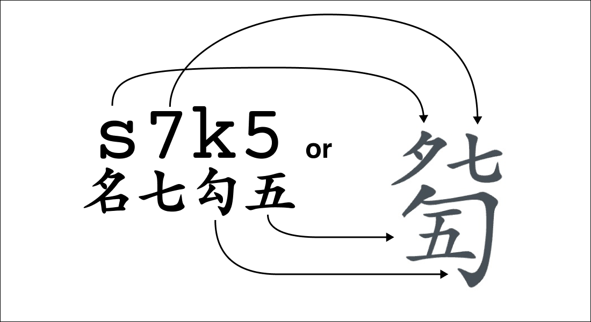

This document goes into detail on how to compile the font, the engineering behond it all. 

For demo and info on how to use this font, please visit the [JianZiPu Font Website](https://guqintabs.com/jianzipu). 

The JianZiPu font system is designed for rendering traditional Chinese guqin notation 减字谱 or JianZiPu. The font supports Chinese characters and ASCII input.

The JianZiPu font uses a glyph layering system where each musical notation character is built by combining multiple component glyphs that stack and position themselves relative to each other. So each character is made of a series of glyphs, similar to how an English word is made of a series of letters.

The rest of this document discusses how to compile the font.

Design of the glyphs is hosted on [this Figma project](https://www.figma.com/design/CC89RmepV34CVP9bKWu48b/JianZiPuComponents?node-id=0-925&t=rNcq1aDc8xLvfPj2-1).

# Section 1. Create Base Font with Input Characters

## 1.1. Extract Input Characters from Source Font

run this script to remove all characters from the font except the ones needed for input in the areaKeySVGMap.csv
also add essential control characters and whitespace a-z, A-Z, 0-9

1. Open source font (TW-Kai)
2. Run: `src/scripts/fontForgeCreateBase.py` -- run inside FontForge (script might take a while to run)
  a. dependency on `src/input/areaKeySVGMap.csv` for getting common, latin, han character set to keep
3. Encoding > Reencode > Glyph Order
4. Run: `src/scripts/fontForgeExportGlyphInfo.py` --> create `src/output/fontforgeGlyphInfo.csv`
5. Open new Font Forge blank file and run `src/sciprt/fontForgeImportGlyphInfo.py`
6. Copy/paste all the characters from the old Font Forge
7. Update Meta Data
-  Font Info > 
  - PS Names: Update
  - General, 800 Ascent + 200 Desc
  - OS/2 > Metrics use 1100 Ascent, 500 Desc, 100 Line Gap
		- NOTE: make sure "is offset" is unchecked!
    - Typo Desc is negative
    - HHead Desc is negative
	- OS/2 > Charsets
		- Unicode Ranges:
			- Basic Latin
			- CJK Symbols and Punctuations
			- CJK Compatibility
			- Private Use Area
		- MS Code Pages
			- 1252, Latin-1
			- 936, Simplified Chinese
			- 950, Traditional Chinese
8. Space: set width to 1000
7. Save As font as base font for use before importing any unicode (JianZiPu.base.sfd)

## 1.2. Rename Chinese Characters for ease of coding
1. Open `src/output/fontforgeGlyphInfo.csv` 
  - add column new_glyph_name and rename manually (ex: ch_8 for 八) -- see rename conventions below
  - Save As: `input/fontforgeGlyphRename.csv` -- NOTE: reference old fontforgeGlyphRename.csv for consistency
2. Run: `src/scripts/fontForgeGlyphRename.py`
3. Save font as base font for use before importing any unicode (JianZiPu.base.sfd)

Naming Conventions:

- numbers: 七 -> ch_7
- basic left and right hands: 勾 -> ch_k 
  - applicable: s d f v , n h j u k i l o U
- others: 圆 -> ch_yuan
- traditional: 圓 -> ch_yuan_trad
- dups, add pinyin tone: 至 -> ch_zhi4; 止 -> ch_zhi3

# Section 2. Import PUA Glyphs

## 2.1. Figma: Export Glyphs to SVG

1. Figma > Glyphs Page
2. Copy glyph, everything in GLYPH
  a. Highlight all symbols
    i. Detach (cmd + opt + B)
    ii. Outline Stroke (Opt + Cmd + O)
    iii. (note: ensure fill is unchecked as part of export )
    iv. Left panel > search for "slice"
    v. Copy all and export as SVG (+ 1x SVG, some might export as jpg and get exluded but for this step)
  b. rename exported files and remove "_slice" (ex: foo_slice.svg >> foo.svg)
3. Repeat for GLYPH_HUI_DECIMALS (expected output is 130, 13 x 10)
4. Copy svg to to `src/components/` folder
5. Rename _slice.svg -> .svg
6. Remove -1.svg (dups due to symbol within symbols in Figma)

## 2.2. Import SVG into FontForge

1. Open file from above (JianZiPu.base.sfd)
2. Save As working font (JianZiPu.sfd)
3. Run: `src/scripts/fontForgeAddJZPGlyphs.py` -- run inside FontForge

# Section 3. Make Feature Rules

## 3.1. Figma Position Info

1. From Figma, export LAYOUT as css into `input/figma.css`
2. Run `cd src/scripts`
2. Run `node ./scripts.cjs --compile -w` to create `src/output/layout_area_positions.json` dictionary

## 3.2. Create Feature File (manual)

File: `src/input/fontForgeFeatures.fea` (reference `src/input/areaKeySVGMap.csv`)

1. Areas: @area_xxx = [md_xxx etc]
	a. add @area_wildcard = [@area_foo @area_bar blank] 
2. Lookups: common to jzp, lat to jzp, han to jzp (ex sub j for lg_tiao)
	a. in calt, keep `sub underscore by blank;`
	b. in calt, add all the translation lookups
3. Positions:
	a. go through each sequence in the layout
	b. do one substitution at a time
	c. some edge cases: 77 7z7 7>7
	d. JZP_POSITION_MEGA_SECTION covers common non-vert jzp, gou, tiao, etc.

## 3.3. Create feature filed with positions filled in (and other)

Run `cd src/scripts`
Run `node ./scripts.cjs --add-positions -w` (this creates an output file with positions filled in)

- # layout: layout_foo => set state to that layout
- @area_blah' <> => will fill in with positions based on the current state layout
- replace JZP_POSITION_MEGA_SECTION with different jzp layouts (e.g., gou, loki, etc.)

## 3.4. Import Features into FontForge

Run `src/scripts/fontForgeRefreshFeatures.py` (or FontForge > Script Menu > JZP > Import Features)

## 3.5. Export font and test in metrics to validate
1. File > Generate Fonts > .ttf and/or .otf  (make sure Options > True Type is checked)

- validate in HTML
- validate in Word

---

The font is licensed under SIL Open Font License 1.1
The code is licensed under MIT License.
The font is derived from TW-Kai font.