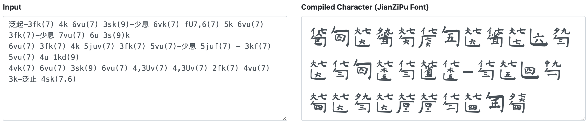
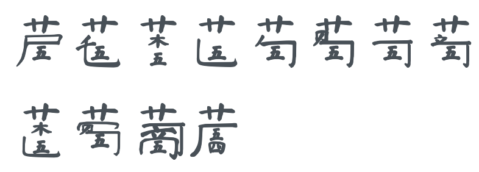
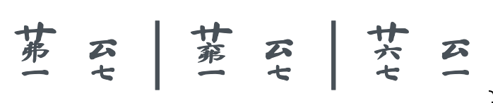
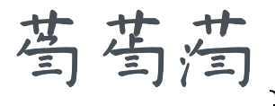

# JianZiPu Font

JianZiPu is a way to write notation for Guqin (古琴) music. This document will cover how to use this font, and how to contribute to its design. 

Demo: https://neuralfirings.github.io/jianzipu/




## Guqin Shorthand for writing JianZiPu

The core of this font is a series of components (think, letters in word) that overlaps to form characters. These letters are represented by unicode characters. To determine which unicode characters to use, we will need to compile a shorthand developed for this font. So a string like `6ks(9)` would produce a character that represents...

* `6` -- 6th string
* `k` -- gou (pluck inward with the right middle finger)
* `s` -- press the string with left hand 4th finger on...
* `(9)` -- hui position 9

.character.png)

### Basic Right Hand

|Input (Alphabetical)|Input (Simplified)|Input (Traditional)|PinYin|
|--|--|--|--|
|n|擘|擘|bō|
|h|托|托|tuō|
|j|抹|抹|mǒ|
|u|挑|挑|tiāo|
|k|勾|勾|gōu|
|i|剔|剔|tī|
|l|打|打|dǎ|
|o|摘|摘|zhāi|
|ju|抹挑|抹挑|mǒ tiāo|
|ki|勾剔|勾剔|gōu tī|
|lo|打摘|打摘|dǎ zhāi|
|U or L|历|歷|lì|


**Example**

```
5n(0) 5h(0) 5j(0) 5u(0) 5k(0) 5i(0) 5l(0) 5o(0)
5ju(0) 5ki(0) 5lo(0) U5,4(0)
```




### Basic Left Hand

|Input (Alphabetical)|Input (Simplified)|Input (Traditional)|PinYin|Output|
|--|--|--|--|--|
|s|名|名|míng|x|
|d|中|中|zhōng|x|
|f|食|食|shí|x|
|v|大|大|dà|x|
|x|跪|跪|guì|x|
|c|掐起|掐起|qiā qǐ|x|
|V or X|罨 or 掩|罨 or 掩|yǎn|x|

**Example**


```
5ks(7) 5kd(7) 5kf(7) 5kv(7) 5kx(7) cs(7) 5Xv(7)
```


### Chords and Chord-ish Things

|Input (Alphabetical)|Input (Simplified)|Input (Traditional)|PinYin|Output|
|--|--|--|--|--|
|Y or FC|反撮|反撮|fǎn cuō|x|
|I or DC|大撮|大撮|dà cuō|x|
|O or DFC|大反撮|大反撮|dà fǎn cuō|x|
|H or C|撮|撮|cuō|x|
|TTT|三弹|三彈|sān dàn|x|
|TT|双弹|雙彈|shuāng dàn|x|
|BL|泼刺|潑刺|pō cì|x|
|B|泼|潑|pō|x|
|L|刺|刺|cì|x|

**Example**

```
3H5 3(0)Y5s(7) 3I5 | 4TT3 4v(7.6)TTT3(0) | 4BL3 4B3 4L3
```


### Glissandos

|Input (Alphabetical)|Input (Simplified)|Input (Traditional)|PinYin|Output|
|--|--|--|--|--|
|GF|滚沸|滾沸|gǔnfú|x|
|G|滚|滾|gǔn|x|
|F|沸|沸|fú|x|
|D|到|到|dào|x|

**Example**

```
1(0)F4 D7 | 1(0)GF4 D7 | 7(0)G4 D1
```




### Speed Modifiers

|Input (Alphabetical)|Input (Simplified)|Input (Traditional)|PinYin|Output|
|--|--|--|--|--|
|/|绰|綽|chaō|x|
|>|急|急|jí|x|
|\\|注|注|zhù|x|

**Example**


```
3k>(0) /3k(0) \3k(0)
```




### Chinese Character Entry Only

|Input (Simplified)|Input (Traditional)|PinYin|Output|
|--|--|--|--|
|退|退|tuì| |
|进|進|jìn| |
|復|復|fù| |
|撞|撞|zhuàng| |
|吟|吟|yín| |
|猱|猱|náo| |
|长吟|長吟|zhǎng yín| |
|细吟|細吟|xì yín| |
|定吟|定吟|dìng yín| |
|分开|分開|fēnkāi| |
|大息|大息|dà xī| |
|少息|少息|shǎo xī| |
|泛|泛|fàn| |
|止|止|zhǐ| |
|起|起|qǐ| |
|泛起|泛起|fàn qǐ| |
|泛止|泛止|fàn zhǐ| |
|带起|帶起|dài qǐ| |
|对起|對起|duì qǐ| |
|爪起|爪起|zhǎo qǐ| |
|撇起|撇起|piē qǐ| |
|打圆|打圓|dǎ yuán| |
|散|散|sàn| |
|如|如|rú| |
|外|外|wài| |
|应合|应合|yīng hé| |

Now, if you just type this in the font you'll get a string of components, not the actual characters. To produce the actual character, you'll need a special compiler. It just so happens, I have included one in this package in the form of a webpage. If you clone this package and open the `index.html` file, you should get a text area for inputting the shorthand. 

You can also find this compiler here: https://neuralfirings.github.io/jianzipu/

## Usage on Websites

If you want to embed JianZiPu in your website, you can copy/paste the three files in the `/dist` folder and include them in your header. 

```
<script src="/path/to/jianzipu.min.js"></script>
<link rel="stylesheet" href="/path/to/jianzipu.css">
```

Or, you can use the GitHub.io as CDN. 


```
<script src="https://neuralfirings.github.io/jianzipu/dist/jianzipu.min.js"></script>
<link rel="stylesheet" href="https://neuralfirings.github.io/jianzipu/dist/jianzipu.css">
```

To render JianZiPu on your website:

* `jzp` class: anything embedded in `[[double brackets]]` will be in JianZiPu string using the JZP font; anything in `[[[triple brackets]]]` will be converted to a JianZiPu charater using the JZP font
* `jzp-font` class: anything here will be use the JianZiPu font

**Example of a String:**

.string.png)
```
<div class="jzp">[[6ks(9)]]</div>
```

**Example of a Character:**

.character.png)
```
<div class="jzp">[[[6ks(9)]]]</div>
```

**Example of Using the Raw Font:**

.character.png)

```
<div class="jzp-font" style="font-size: 5rem">&#58101;&#58090;&#58053;&#58063;</div>
```

## Usage as a Font

To use the font, install `/dist/JianZiPu.otf` file. You will still need a compiler since the font itself uses unicodes in the 58000 range (per its html entity)

You can access the compiler here: https://neuralfirings.github.io/jianzipu/ 

You type in the string (e.g., `3ks(7)`), and then copy/paste the compiled characters. 

You can also use the unicodes themselves, but this might get a bit unweildy. 

## Technical Documentation

This is the part where we go into the nitty gritty of how this font works, and how you can contribute in this project. 

There are three main components to the font. 

### 1. Character component graphics SVGs

These are the raw graphics (SVGs) that make up individual components in a JianZiPu character. These are stored in the `/components` folder. I use `/font/JianZiPuComponents.sketch` to organize my workspace and generate SVGf files in bulk. 

### 2. Character map (`charMap`) JSON

This represents a "map" of how various components can be laid out in the character. The map is a JSON object with different areas. Each area has:

* *x*: x coordinate of where the area starts relative to the top/left corner of the character
* *y*: y coordinate of where the area starts relative to the top/left corner of the character
* *w*: the width of the area
* *h*: the height of the area
* *components*: an array of components that can go into the area. Each component is an object with...
	* *key*: this represents what the compiler looks up. For example, the key `1` represents a component representing 1. The key `k` represents a gou component. 
	* *filename*: this is the filename (SVG) for the component
	* *unicode*: this is the unicode to assign to the component
	* *width*: this is the width of the component. Most components have 0 as width, so the componenets can layer and stack on top of one another. 
	* *scale* (optional): this is how we want to scale the component to fit its area. By default, it will scale horizontally and vertically to fit the area. There's also the option of using `lockRatio` so the component's ratio remains the same. 

This map is present in `/dist/jianzipu.js` and `/font/fontForgeScript.py`.

### 3. Character rules (`charRules`) JSON

This map represents the rules used to compile the font from shorthand. It's a series of RegEx expressions which matches a particular string (e.g., if a hui position exists), and assigns which areas to the matching string. 

The compiler then executes the areas in order. For example `{ regex: /[0-9]/, area: 'strFull'}` is the first rule, which looks for the existance of numbers to assign it to the `strFull` area. Later rules will assign any numbers as areas specific to huis (if parentheses exists) or smaller areas in the component if things like left hand keys exists. 

### Font Compiling Instructions

These are the steps I use. 

1. Edit components
	* Open `/src/JianZiPuComponents.sketch`: select all / export as SVG (transparent background)
	* Working on a Figma file to produce the SVGs: https://www.figma.com/file/A6CYEphQAU0spsjnHjtGRl/JianZiPuComponents
2. Modify `/src/charMap.js` file
	* Make sure unicodes are unique and something in the 58000 range
	* To do this in Sublime (with Text Pastry plugin): highlight `"unicode": ` > Ctrl+Cmd+G to select all > Scroll over to the unicodes and replace with > Package: Text Pastry Command Line, `\i(58000,1)`
3. Modify `/src/charRules.js` file if rules need to be modified. Get comfy with RegEx.
4. Create the font
	* Open JianZiPu.blank.sfd, save as new version (ex: JianZiPu.sfd) (also update the font version Edit > Font Info)
	* Modify `/src/fontForgeScript.py` > HOME_PATH so that it's pointing to the JianZiPu directory
	* Open Python console (Ctrl + .) > copy/paste in fontForgeScript.py > run
	* Generate Font > select Open Type, save as .otf file (make sure Options > Open Type is checked)
5. Compile Javascript, while in JianZiPu directory..
	* run `./build` to build for the dist folder

## Credits/License

Code is licensed under [The MIT License](https://opensource.org/licenses/MIT). 

Font is licensed under [Open Font License](https://scripts.sil.org/cms/scripts/page.php?site_id=nrsi&id=OFL).

Font is adapted from the beautiful [Ma Shan Zheng](https://fonts.google.com/specimen/Ma+Shan+Zheng) font.
